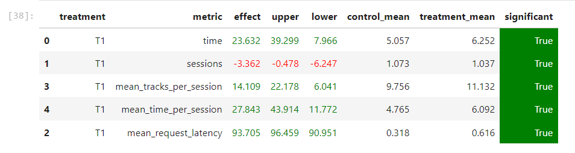

# Основная идея

Обучить нейросетевой рекомендер заново и получить вместе с рекомендациями их предсказанные скоры.
Выбирать рекомендации с вероятностями, которые зависят от предсказанного скора.
Поверх этого навесить некоторые эвристики.

# Детали:

Некоторые детали реализации:

* В botify/data/my_track_with_recs.json хранятся новые рекомендации вместе с их скорами
* Были обновлены топ треки в botify/data/top_tracks.json
* Добавлена БД user_sessions_redis для хранения треков, прослушанных пользователем в текущей сессии
и рекомендации треков на основе треков из данной сессии с хорошим скором
* Фолбечимся на измененные TopPop рекомендации
* Если предсказанный скор рекомендации слишком маленький - фолбечимся
* Не предсказываем треки, которые уже попадались в эту сессию

# Запуск

Дефолтный запуск по инструкции из модуля sim

# Результат:

